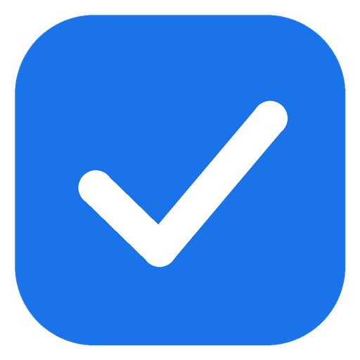

# google-tasks-mcp



A single-file Python MCP server for Google Tasks. Runs via `uv run --script`
(PEP 723 inline dependencies — no venv or install step).

## Tools

| Tool | Purpose |
| --- | --- |
| `list_tasklists` | List task lists (id + title) |
| `list_tasks` | List tasks in a list (optionally completed ones) |
| `create_task` | Create one task with optional notes and due date |
| `create_recurring_tasks` | Create N dated tasks spaced K days apart (the API can't set repeat rules, so a series of individual tasks stands in for one) |
| `update_task` | Change a task's title, notes, or due date |
| `complete_task` | Mark a task completed |
| `delete_task` | Delete a task permanently |

## Setup

### Option A: install via prompt

Paste this into Claude Code (or another capable coding agent) and it will
work through the setup with you, including the Google Cloud Console parts:

```
Set up the Google Tasks MCP server from
https://github.com/jandersson/google-tasks-mcp. Work through these steps in
order, checking current state first — some may already be done:

1. Clone the repo to a sensible location if I don't have it already.
2. Verify uv is installed (uv --version); if missing, install it
   (winget install astral-sh.uv on Windows, brew install uv on macOS).
3. Check that credentials.json exists at
   ~/.config/google-tasks-mcp/credentials.json
   (Windows: %USERPROFILE%\.config\google-tasks-mcp\credentials.json).
   If not, walk me through creating it step by step:
   console.cloud.google.com → enable "Google Tasks API" → configure the
   OAuth consent screen (audience External; the app name must not contain
   "Google"; add my own account as a test user on the Audience page) →
   Clients → Create client → type "Desktop app" → I download the JSON and
   you save it to that exact path.
4. Register the server:
   claude mcp add --scope user google-tasks -- uv run --script "<absolute path to server.py in my clone>"
5. Tell me to start a new Claude Code session (newly added MCP servers only
   load in a fresh session) and verify the registration with claude mcp list.
6. Remind me that the first google-tasks tool call opens a browser for
   Google authorization (the "unverified app" warning is expected), and
   that I should publish the OAuth app per the README's "Optional: publish
   the OAuth app" section — otherwise the token expires after 7 days in
   Testing status.
```

### Option B: manual setup

#### 1. OAuth client

1. Go to [console.cloud.google.com](https://console.cloud.google.com), pick or
   create a project.
2. **APIs & Services → Library** → enable **Google Tasks API**.
3. Configure the consent screen (**Google Auth Platform**, or **OAuth consent
   screen** in the sidebar): audience **External**, fill the required fields.
   The app name must not contain "Google" — Google rejects it.
4. On the **Audience** page, add your own Google account under **Test users**
   (it may already be there).
5. **Clients → Create client**, application type **Desktop app**.
6. Open the created client and **Download JSON** (in the Client secrets
   section), then save it as:

   ```
   %USERPROFILE%\.config\google-tasks-mcp\credentials.json   (Windows)
   ~/.config/google-tasks-mcp/credentials.json               (macOS / Linux)
   ```

`token.json` is written next to it after the first authorization. Neither file
belongs in git.

#### 2. uv

Requires [uv](https://docs.astral.sh/uv/). On Windows:

```
winget install astral-sh.uv
```

On macOS:

```
brew install uv
```

(or the [standalone installer](https://docs.astral.sh/uv/getting-started/installation/):
`curl -LsSf https://astral.sh/uv/install.sh | sh`, which also covers Linux)

#### 3. Register with Claude Code

Clone the repo anywhere you like:

```
git clone https://github.com/jandersson/google-tasks-mcp.git
```

Then register the server, substituting the absolute path to your clone:

```
claude mcp add google-tasks -- uv run --script "/path/to/google-tasks-mcp/server.py"
```

(e.g. `C:\Users\you\google-tasks-mcp\server.py` on Windows,
`/Users/you/google-tasks-mcp/server.py` on macOS)

Restart Claude Code afterwards — newly added MCP servers only load in a new
session.

## First run

The first tool call opens a browser for Google authorization. Approve it (the
"unverified app" warning is expected for a personal test-user client) and the
token is cached; later calls run without a browser.

## Optional: publish the OAuth app

Recommended. While the OAuth app's publishing status is "Testing", Google
expires refresh tokens after **7 days**, so you're re-authorizing in a
browser every week. Publishing to production makes the token permanent. No
verification review is needed for personal use — the consent screen just
keeps its "unverified" warning.

1. **Branding** page: fill in an **Application home page** and an
   **Application privacy policy link**, and add their domain under
   **Authorized domains**. GitHub Pages on your fork works — enable Pages
   on the repo and the bundled [privacy.md](privacy.md) serves as the policy
   ([example](https://jandersson.github.io/google-tasks-mcp/privacy.html)).
   The Publish button stays greyed out until these are saved.
2. **Data Access** page: **Add or remove scopes** → manually add
   `https://www.googleapis.com/auth/tasks` → Update → Save.
3. **Audience** page: **Publish app**.
4. Delete `token.json` and authorize once more — that token won't expire.

Two traps: don't upload a **logo** (that's what makes the verification
review mandatory), and Workspace users shouldn't click **Make internal**
if the Google account they authorize with is outside their organization —
it would be locked out.

## Troubleshooting

- **Auth stops working after ~a week**: Testing-status refresh tokens
  expire after 7 days — see "Optional: publish the OAuth app" above.
- **Tools don't appear after registering**: MCP servers load at session
  start, and resuming an existing conversation keeps its old tool set —
  start a *new* session.
- **Re-authorizing**: delete `token.json` from the config directory and the
  next tool call opens the browser again.
- **`create_recurring_tasks` is not idempotent** — running it twice creates
  two full series of tasks.
